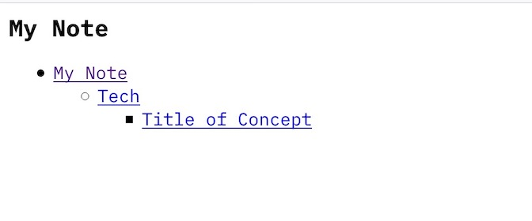
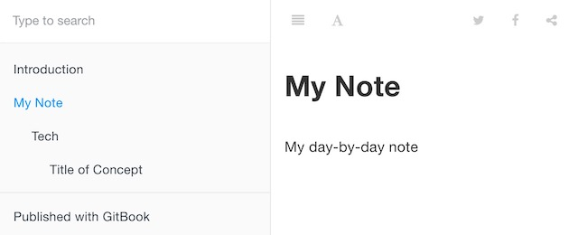

# ditanote
Simple Private Knowledge Base with DITA Markdown

## Prerequisite

* [DITA Open Toolkit](https://www.dita-ot.org/)

    - It will convert your markdown to html
    - Markdown support feature is maintained in [GitHub - jelovirt/org.lwdita: LwDITA parser for DITA-OT](https://github.com/jelovirt/org.lwdita)
    - Java is also required by DITA Open Toolkit

* [gitbook/setup.md at master · GitbookIO/gitbook · GitHub](https://github.com/GitbookIO/gitbook/blob/master/docs/setup.md)

    - It will create searchable knowledge base
    - npm is also required by gitbook


## Setup
Before you start, you need to finish the following tasks:

1. Create `.backstage/note.properties` and add the followings. Also you need to replace `<<PATH_TO_THIS_PROJECT>>` with your environment.

    ```
    # Task
    args.gen.task.lbl = YES

    # Location of the copied .css file relative to the output:
    args.csspath = css

    # Copy css
    args.copycss = YES

    args.css = style.css
    args.cssroot = <<PATH_TO_THIS_PROJECT>>/ditanote/.backstage/
    ```

2. Create dir and put the markdown contents

    This template includes sample dir `tech`, but if you need to add another dir, you need to follow steps:

    1. Create a dir (e.g. `food`)
    2. Put a `index.md` into the dir with the following content.

        ```
        # Food {.topic}
        Food related topic
        ```

    3. Add the relative path to the above `index.md` into the `note.ditamap` under the project root dir
    4. Add the relative path to the above created dir into the `ditadirs.txt` under the `.backstage` dir


## Commands
You can find the command in `Makefile`
The flow is Create Map File (which files will be converted and displayed) -> Build Output using Map File.

You can put these output into your web server(e.g. nginx) for your private knowledge base.

### html output

* Build html: `make html`

    The output will be put into `out` dir

The output is should be like the following:



### book output
Before you start, you need to run `sudo npm i -g gitbook-cli`

* Build gitbook: `make book`

    The output will be put into `out/_book` dir

* Build gitbook and serve: `make book-serve`

The output is should be like the following:




## Notes
* These links might be your help.

    - [Language reference](https://www.oxygenxml.com/dita/1.3/specs/langRef/langRef-learningTraining.html) DITA langulage specs
    - [GitHub - tkhm/ditalime: Python GUI App for DITA Entry Support](https://github.com/tkhm/ditalime) It will help to create a markdown file with dita (lw-dita) format

* Gitbook CLI is under the maintainance mode and active development is stopped. This project is using it for gitbook based output creation. We need to pay attention to the Gitbook CLI's project status and npm repo's condition.
